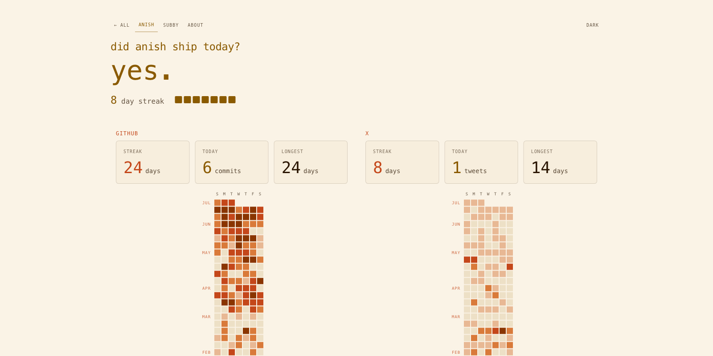

# Commiter

**Did we ship today?** A dashboard that answers that question per person, combining GitHub contributions with X posts and optional TikTok videos into streaks and heatmaps. File-backed data, no database.



## How it works

A day counts as **shipped** when GitHub has activity *and* at least one configured social source (X or TikTok) has activity. If no social data is available for a user, they fall back to GitHub-only.

- `/` — all tracked people at a glance
- `/[slug]` — one person's heatmaps, streaks, and daily counts
- `/about` — public explanation
- `/join` — add-person form that opens a prefilled GitHub issue
- `/api/snapshot?user=anish&days=365` — JSON snapshot; `days` clamps to 7–365

## Quick start

Requires Node 20+ and pnpm 9.

```bash
pnpm install
cp .env.example apps/web/.env.local
# set GITHUB_TOKEN in apps/web/.env.local
pnpm dev   # http://localhost:3000
```

| Variable | Required | Purpose |
|---|---|---|
| `GITHUB_TOKEN` | yes | GitHub PAT with `read:user` |
| `NERV_TZ` | no | Timezone; defaults to `America/Los_Angeles` |

No X API key is needed at runtime — the app reads bundled X data refreshed by GitHub Actions.

## Data model

Everything is files in the repo; there is no database.

- People roster: `apps/web/src/config/users.json`
- X day counts: `apps/web/src/data/x-days-by-slug.json`
- TikTok day counts: `apps/web/src/data/tiktok-days-by-slug.json`
- Refresh workflows: `.github/workflows/refresh-x-days.yml`, `refresh-tiktok-days.yml`

### Adding someone

Edit `users.json` with handles only, no `@`:

```json
{
  "slug": "anish",
  "displayName": "anish",
  "githubLogin": "anishthite",
  "xLogin": "anishthite",
  "tiktokLogin": "anishthite"
}
```

## Checks

```bash
pnpm typecheck
pnpm tsx scripts/check-people.ts
```

## Deployment

Deploys to Vercel.

**Vercel runtime env:** `GITHUB_TOKEN` (required), `NERV_TZ` (optional)

**GitHub Actions secrets:**

- `X_BEARER_TOKEN` — X data refresh (official X API v2, pay-per-use ≈ $1–3/mo)
- `TIKTOK_CLIENT_KEY`, `TIKTOK_CLIENT_SECRET`, `TIKTOK_REFRESH_TOKENS_JSON`, `TIKTOK_OPEN_IDS_JSON` — TikTok refresh
- `VERCEL_DEPLOY_HOOK_URL` — optional deploy hook after refresh

## More

- Full spec: [`PLAN.md`](PLAN.md)
- Design decisions and tradeoffs: [`implementation-notes/`](implementation-notes/)
